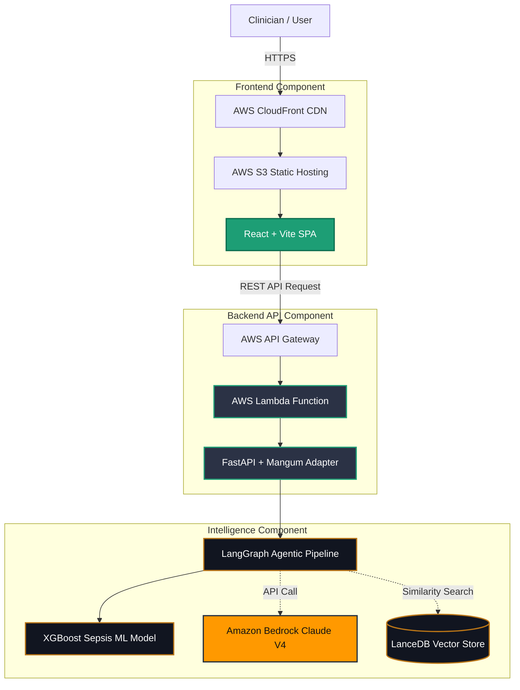

# System Architecture Design
## HRV Agentic Intelligence System

This document outlines the high-level architecture, module interaction, and deployment strategy for the HRV Intelligence platform.

---

## 1. High-Level Overview

The system operates across three tiers:
1. **Frontend (Presentation Tier):** A React SPA hosted statically on S3/CloudFront.
2. **Backend API (Application Tier):** A FastAPI serverless application executing on AWS Lambda (via Mangum adapter).
3. **Agentic AI & ML (Intelligence Tier):** A multi-agent LangGraph state machine bridging XGBoost heuristics with AWS Bedrock Foundation Models.

### Full System Diagram

---

## 2. Frontend Architecture (React)

The React dashboard is optimized for pure client-side rendering (SPA) with zero external CSS frameworks, emphasizing high-performance data visualization.

- **Vite:** Next-generation build tool configured for minimal chunk sizes.
- **State Management:** Functional React Hooks (`useState`, `useMemo`, `useCallback`) alongside `React.forwardRef` to expose API methods up the tree.
- **Recharts:** Used for generating SVG-based data plots (HRV boundaries, Recovery bar charts, Sleep-to-HRV scatter plots).

**Key Modules:**
- `App.jsx`: Main UI controller, holds Theme State, instantiates layout panes.
- `AICoach.jsx`: Exposes `sendMessage` via `useImperativeHandle` for external triggers, maintaining internal chat history.
- `Cards.jsx`: Extensible widget templates mapping biometric parameters.

---

## 3. Backend Architecture (FastAPI)

The backend exposes stateless endpoints required for multi-modal analysis and conversational guidance. Local development uses Uvicorn, while production relies on Mangum to bridge ASGI traffic to AWS Lambda.

**Key Endpoints:**
- `POST /analyze/single`: Synchronous execution of the 8-node LangGraph pipeline.
- `POST /chat`: Renders the WHOOP-methodology system prompt alongside user input to Bedrock.
- `GET /health`: Heartbeat route verifying model ingestion.

---

## 4. Agentic AI Pipeline (LangGraph)

The core scientific analyzer is built as a state machine using `langgraph`. It executes a deterministic cyclic graph handling edge failures gracefully.

### Pipeline Nodes
1. **Validation Node (`validation.py`):** Asserts data schema adherence to all 59 HRV features.
2. **Feature Analysis (`feature_analysis.py`):** Uses Claude Haiku to isolate domains (e.g., Poincaré vs Frequency).
3. **Anomaly Detection (`anomaly_detection.py`):** Hardcoded deterministic algorithm (Z-Scores & IQR thresholds).
4. **ML Scoring (`ml_scoring.py`):** Triggers the pre-trained `XGBoost` model for a binary Sepsis3 risk probability computation.
5. **RAG Retrieval (`rag_retrieval.py`):** Performs cosine similarity against Titan embeddings in LanceDB.
6. **Clinical Interpretation (`clinical_interpretation.py`):** Heavyweight autonomic analysis using Claude Sonnet.
7. **Recommendation (`recommendation.py`):** Synthesizes steps ordered by severity via Haiku.
8. **Synthesis (`synthesis.py`):** Final JSON struct construction formatting outputs securely for the frontend.

---

## 5. Deployment Architecture (AWS Serverless)

The application embraces a strict serverless philosophy to optimize cost profile.

**Infrastructure:**
1. **GitHub Actions:** CI/CD pipeline pushes tagged Docker images to ECR.
2. **Amazon ECR:** Private container registry holding the FastAPI + XGBoost image.
3. **AWS Lambda:** Provisions compute on-demand via the ECR image URI.
4. **API Gateway:** HTTP API bridging public internet to the Lambda function.
5. **AWS Secrets Manager:** Secure runtime injection of Bedrock authentication credentials.

For step-by-step deployment routines, refer to the [Deployment Guide](DEPLOYMENT.md).
